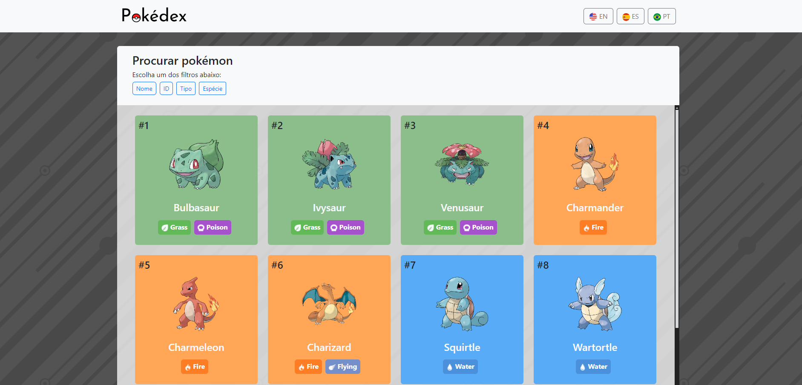
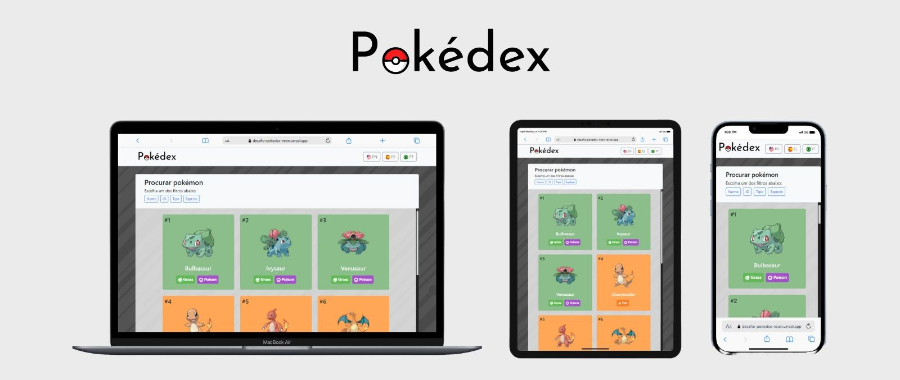
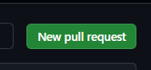

[](https://opensource.org/licenses/MIT)

#### Você pode acessar o projeto por aqui <a target="_blank" href="https://desafio-pokedex-neon.vercel.app/">Pokédex.</a>


## 💻 Projeto

Foi desenvolvido para atender os requisitos de um desafio técnico de um processo seletivo, trata-se de uma aplicação web que funciona como uma Pokédex. Todos os dados sobre os pokémons foram fornecidos pela API REST [PokéApi](https://pokeapi.co/).

### Funcionalidades

- **Listagem dos pokémons**: exibe os Pokémons utilizando a API REST.

- **Scroll infinito**: sempre que o usuário vai rolando a página, vão sendo exibidos mais pokémons.

- **Buscar pokémons**: permite o usuário filtrar pokémons por nome, ID, tipo ou espécie.

- **Escolher idioma**: por padrão o aplicativo está em português, mas permite que o usuário possa escolher se quer exibir os dados em mais dois idiomas, inglês ou espanhol.

- **Detalhar pokémon**: ao clicar no card do pokémon, é exibido um modal com os detalhes do pokémon como nome, imagem, tipo(s), sprites, movimentos de ataque, evoluções e índices de jogo.

- **Responsividade**: o layout do projeto se adapta a diversas telas de tamanhos diferentes.


### Conceitos praticados
- Responsividade.

- Configuração e utilização do [ESLint](https://eslint.org/).

- Utilização do framework [Vue.js](https://vuejs.org/).

- Utilização do [Bootstrap](https://getbootstrap.com/).

- Gerenciamento de estados com [VueX](https://vuex.vuejs.org/).

- Consumo de API com o uso da lib [Axios](https://github.com/axios/axios).

- Internacionalização com o uso do [Vue-i18n](https://www.npmjs.com/package/vue-i18n).


## 🛠️ Techs:

[](https://skillicons.dev)


## 🚀 Quickstart

1. Clone o projeto:

   ```shell
   git clone git@github.com:Raul-Albuquerque/desafio-pokedex.git
   ```

2. Acesse a pasta do projeto:

   ```shell
   cd desafio-pokedex
   ```

3. Instale as dependências:

   ```shell
   npm install
   ```

4. Rode o projeto:

   ```shell
   npm run dev
   ```

<!-- ## 🔄 Contribuindo

1. **Faça o fork do projeto**:<br>


2. **Crie uma nova branch**:
    ```shell
    git checkout -b <nomedabranch>
    ```

3. **Commit suas mudanças**:
    ```shell
    git commit -m 'descreva a mudança'
    ```

4. **Suba as alterações para o github**:
    ```shell
    git push origin 'nomedabranch'
    ```

5. **Abra um pull request**:<br>
 -->

## 📊 Status

O status atual do projeto é: "completo"✅.

## 👨🏻‍💻 Autor

Esse projeto foi criado por [Raul Albuquerque](https://github.com/Raul-Albuquerque).

<!-- ## 📬 Contato

Para mais informações ou colaborações nesse projeto, entre em contato por raulmalbuquerque2014@gmail.com. -->